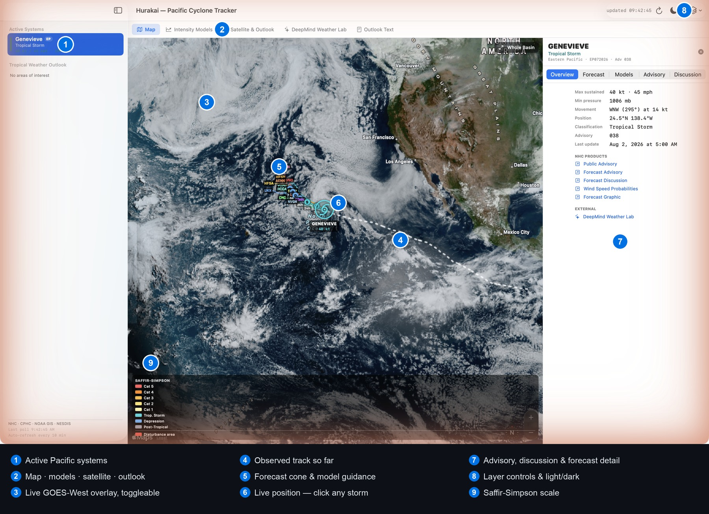

# Hurakai

**A native macOS tracker for hurricanes and tropical disturbances in the Eastern and Central Pacific** — live positions, forecast tracks, uncertainty cones, watches and warnings, and full ATCF model guidance on a clickable MapKit chart, including Google DeepMind's cyclone ensemble.


`macos` `swift` `swiftui` `mapkit` `swift-charts` `hurricane` `tropical-cyclone` `weather` `noaa` `nhc` `cphc` `atcf` `a-deck` `deepmind` `gdmn` `goes` `satellite-imagery` `pacific` `hawaii` `desktop-app`



---

## Contents

- [What it is](#what-it-is)
- [Basin scope](#basin-scope)
- [Screens](#screens)
- [Data sources](#data-sources)
- [Model guidance comes from the a-deck](#model-guidance-comes-from-the-a-deck)
- [Third-party sources](#third-party-sources)
- [Appearance](#appearance)
- [Requirements](#requirements)
- [Install](#install)
- [Build from source](#build-from-source)
- [Packaging](#packaging)
- [Code signing status](#code-signing-status)
- [Repository layout](#repository-layout)
- [Not a forecast product](#not-a-forecast-product)

---

## What it is

Hurakai is a single-window macOS application that consolidates the operational picture for a
Pacific tropical cyclone: where the storm is, where it is forecast to go, how confident that
forecast is, what every guidance model says about its track and intensity, and what the
forecaster wrote in the discussion.

Everything is fetched live from NOAA and NWS endpoints. There are no third-party libraries,
no package manager, and no build step beyond `swiftc` — the app links only against system
frameworks (SwiftUI, MapKit, Swift Charts, WebKit, Compression).

## Basin scope

Eastern and Central Pacific. Central Pacific is the CPHC domain — 140°W to the dateline,
the Hawai'i basin — and the default map view spans the Mexican coast west past Hawai'i to
the dateline.

Both Central Pacific (CPHC) and Eastern Pacific (NHC) systems arrive through the same feeds;
the GIS service and `CurrentStorms.json` cover the `EP`, `CP`, and `AL` basins.

Basin strings from the outlook layers are normalised (`EP`/`CP`/`AL` plus spelled-out and
`*PAC` variants). An outlook area whose basin cannot be identified is dropped rather than
guessed at, so the failure mode is a missing Pacific area rather than an Atlantic one
appearing in a Pacific-scoped application. The Atlantic can be enabled explicitly from the
Layers menu; it is off by default.

## Screens

- **Map** — every active system on one chart. Selecting a storm zooms to its cone and opens
  an inspector with current intensity, motion, the forecast point table, the full public
  advisory, and the forecast discussion. Layers — cone, forecast track, past track, forecast
  points, watches and warnings, disturbance areas, model guidance, **live GOES-West satellite
  imagery**, labels — toggle individually. The base map switches between hybrid, satellite,
  and standard.
- **Satellite overlay** — GOES-West GeoColor draped over the map as Web Mercator tiles from
  NASA GIBS, refreshed with the satellite (roughly every 10 minutes), so the cloud field and
  the forecast geometry are readable together. Toggled from the Layers menu; off by default.
- **Models** (inspector tab) — full ATCF model guidance for the selected storm, drawn as a
  spaghetti plot with labelled endpoints. Each technique toggles individually; featured
  models are enabled by default and "Every technique" reveals the ensemble members. Includes
  `GDMN`, the Google DeepMind ensemble mean.
- **Intensity Models** — the intensity counterpart to the track spaghetti: each technique's
  wind forecast against forecast hour, with Saffir-Simpson thresholds marked and the official
  forecast drawn heavier. One tab per active Pacific system. Shares model toggles with the
  map, so disabling a technique in one view disables it in both. Includes the intensity-only
  aids (`SHIP`, `LGEM`, `DSHP`, `IVCN`) that have no track to plot.
- **Satellite & Outlook** — NHC/CPHC 2-day and 7-day graphical outlooks, and GOES-West
  GeoColor and Air Mass imagery (full disk and Hawai'i sector), scaled to the window.
- **DeepMind Weather Lab** — Google's experimental AI cyclone predictions.
- **Outlook Text** — the Eastern and Central Pacific Tropical Weather Outlook discussions.

Data refreshes on launch, on ⌘R, and every 10 minutes.

## Data sources

| Source | What it provides | Transport |
| --- | --- | --- |
| NHC `CurrentStorms.json` | Active systems: position, intensity, pressure, motion, advisory links | JSON |
| NOAA Tropical GIS MapServer | Forecast points, forecast track, uncertainty cone, past track, watches and warnings, TWO disturbance areas | ArcGIS REST → GeoJSON |
| NHC ATCF a-decks | Every technique's track and intensity guidance, including Google DeepMind (`GDMN`) | Gzipped flat file |
| NHC / CPHC text products | Public advisories, forecast discussions, Tropical Weather Outlooks | HTML, `<pre>` extracted |
| NHC Graphical TWO | 2-day and 7-day outlook graphics | PNG |
| NOAA NESDIS/STAR | GOES-18 (GOES-West) GeoColor and Air Mass imagery | JPEG |
| NASA GIBS | GOES-West GeoColor as Web Mercator tiles, for the map overlay | WMTS |
| Google DeepMind Weather Lab | Experimental AI cyclone predictions | Embedded web view |

## Model guidance comes from the a-deck

Model track and intensity guidance is read from the NHC **ATCF a-deck**
(`aid_public/a{basin}{nn}{year}.dat.gz`), which NHC publishes openly. This is the same
dataset behind the model plots on third-party cyclone sites, so the underlying numbers are
available natively rather than by scraping rendered images.

`GDMN` is the **Google DeepMind ensemble mean**, contributed to NHC's guidance suite. It
arrives through the a-deck with no API key, no Google Cloud project, and no sign-in.
`GDMI` (interpolated) and `GDM2` appear alongside it.

Three conventions in the format are handled explicitly:

- **Per-technique cycles.** Each technique keeps its own most recent initialisation cycle
  rather than a single global "latest". Models run at 00/06/12/18Z while the official
  forecast runs at 03/09/15/21Z, so a global cutoff would silently drop `OFCL`.
- **Repeated rows.** Rows repeat per wind-radius threshold (34/50/64 kt), so positions are
  de-duplicated by forecast hour.
- **Position-less aids.** Intensity-only aids — `SHIP`, `LGEM`, `DSHP`, `IVCN` — publish
  `0N`/`0W` rather than omitting the position. Taken literally that draws a track from the
  storm to 0°N 0°E, so those points are treated as carrying intensity without position:
  absent from the map, present in the intensity chart.

## Third-party sources

**Google DeepMind Weather Lab** is presented as a web view. It has no public API and requires
a Google sign-in, so the application renders the site for the user to authenticate with
directly and never handles credentials itself.

**WeatherNext via BigQuery / Earth Engine** is not implemented. Google's WeatherNext datasets
are reachable through BigQuery and Earth Engine, but for cyclone track and intensity guidance
they are a longer route to `GDMN`, which the a-deck already provides. That path would add
value only for the **gridded** fields — global forecast grids of wind, pressure, temperature
and precipitation, or per-member ensemble output. It also requires a GCP project with
billing, the datasets subscribed through Analytics Hub, and the `gcloud`/`bq` tooling. The
natural shape, should it be added, is a helper that queries BigQuery with existing `gcloud`
credentials and hands the application JSON, keeping OAuth out of the app entirely.

## Appearance

Light by default, with a moon/sun button in the toolbar to switch to dark. The choice
persists between launches.

The Saffir-Simpson palette is tuned for dark satellite imagery — pale yellow Cat 1 and a
white official-forecast line disappear against white — so application chrome (sidebar, tabs,
inspector, intensity chart) uses light-mode counterparts derived from the same hues, while
map overlays keep the bright originals because the map always draws on imagery. A single
transform derives the light variant rather than maintaining two hand-tuned palettes;
achromatic colours resolve to near-black rather than grey, which is what keeps `OFCL`
legible.

## Requirements

macOS 14 or later, and a network connection — every forecast, model and image is fetched
live. Building additionally requires the Xcode Command Line Tools; full Xcode is not needed.

## Install

Download the disk image from [Releases](https://github.com/davekatjang/Hurakai/releases) and
drag Hurakai to Applications. See [Code signing status](#code-signing-status) for the
first-launch step.

## Build from source

```bash
./build.sh && open build/Hurakai.app
```

Self-checks over the parsing, geometry, and scoping logic:

```bash
./test.sh
```

The test target compiles `Sources/Hurakai/Data.swift` against `Tests/main.swift` and runs
assert-based checks over GeoJSON decoding, a-deck parsing, gzip handling, region math,
basin scoping, and the advisory text extractor. No test framework is involved.

There is no `Package.swift`. `build.sh` invokes `swiftc` directly and assembles the bundle:
MapKit and WebKit require a real `.app` (bundle identifier plus `Info.plist`) regardless, so
a SwiftPM manifest adds nothing, and the `PackageDescription` library shipped with the
Command Line Tools fails to link at any tools-version.

## Packaging

```bash
./package.sh
```

Builds a universal (arm64 + x86_64) application and wraps it in
`dist/Hurakai-<version>.dmg` — drag to Applications, roughly 1.3 MB. `hdiutil` ships with
macOS, so there is no packaging dependency to install. A `.dmg` rather than a `.pkg`: a
`.pkg` installer earns its keep when install scripts, receipts, or files outside
`/Applications` are needed, and none apply here.

`./build.sh --universal` performs the two-architecture build on its own; plain `./build.sh`
stays single-architecture so development builds remain fast.

## Code signing status

The bundle is ad-hoc signed with no Apple Developer ID and is not notarized, so macOS will
refuse the first launch on any Mac that did not build it. Right-click the application,
choose **Open**, then **Open** again in the dialog; subsequent launches behave normally. If
macOS reports that the app "is damaged", clear the download quarantine flag:

```bash
xattr -dr com.apple.quarantine /Applications/Hurakai.app
```

The disk image ships a README stating both steps. Removing this friction requires a paid
Apple Developer account to sign with a Developer ID and notarize the disk image.

## Repository layout

```
Sources/Hurakai/Data.swift     models, GeoJSON and ATCF decoding, feeds, networking
Sources/Hurakai/App.swift      app entry, refresh loop, shell, layer menu
Sources/Hurakai/MapPane.swift  map, overlays, pins, Saffir-Simpson palette
Sources/Hurakai/Panels.swift   sidebar, inspector, intensity chart, imagery, web and text panes
Tests/main.swift               assert-based self-checks
build.sh                       compiles and assembles Hurakai.app
package.sh                     universal build wrapped in a drag-to-install disk image
test.sh                        runs the self-checks
docs/                          README assets
```

The map is an `MKMapView` behind an `NSViewRepresentable` rather than SwiftUI's `Map`.
SwiftUI's `Map` has no tile-overlay API at any deployment target, and a georeferenced
satellite layer has to be tiles. The SwiftUI pin views are reused unchanged by hosting them
inside the annotation views, so dropping down costs nothing visually.

## Not a forecast product

Hurakai displays official NHC and CPHC data but is not itself an official source. For
warnings and protective decisions, use [hurricanes.gov](https://www.nhc.noaa.gov) and the
local NWS office.
